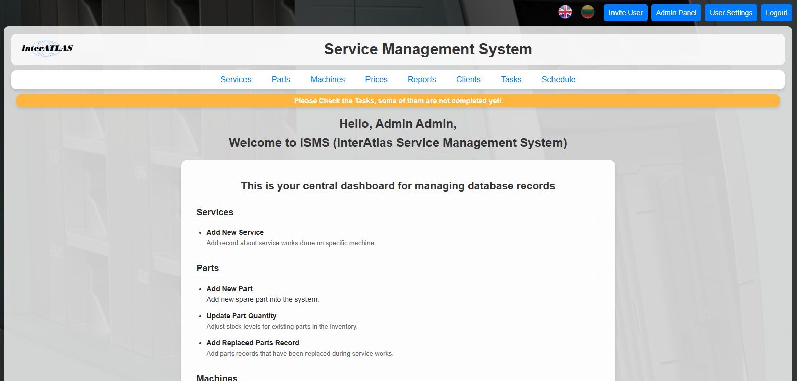
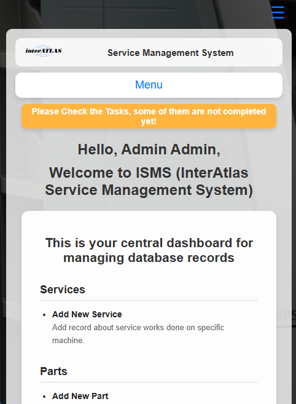
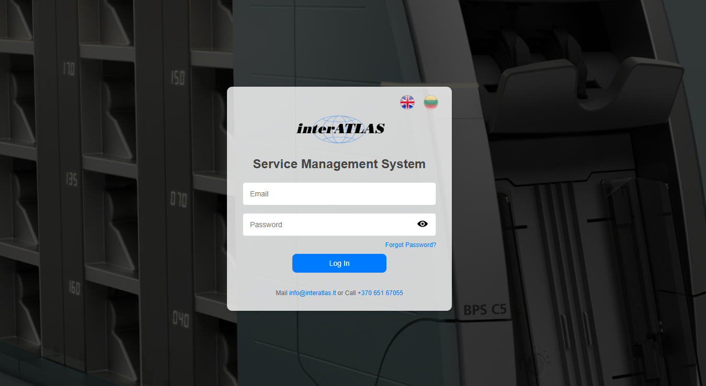

# ISMS - Interatlas Service Management System

Interatlas Service Management System (ISMS) is a Flask-based web application designed to streamline and document the service operations of Interatlas company engineers. The system enables engineers to log service visits, track money counting machines, monitor part replacements and inventory across locations, manage visit schedules and tasks.

## Project Structure

```
Service-Management-System/
├── Management_system/
│   ├── __init__.py           # App factory
│   ├── config.py             # Configuration
│   ├── forms.py              # Flask-WTF forms
│   ├── localization.py       # Language translation logic
│   ├── models.py             # SQLAlchemy models
│   ├── routes.py             # Flask routes and views
│   ├── utils.py              # Utility functions
├── tests/
│   ├── test_models.py        # Models tests
│   ├── test_routes.py        # Routes tests
│   ├── test_utils.py         # Utility tests
│   ├── test_localization.py  # Localization tests
├── instance/
│   └── interatlas.db         # SQLite database
├── logs/
│   ├── mail_sender.log       # Mail log
│   └── user_actions.log      # User behavior log
├── run.py                    # Main app
├── requirements.txt          # Python dependencies
├── coverage_report.txt       # Code coverage summary
```

## Run Locally

Clone the repository

```bash
  git clone https://github.com/laimonas-zove/Service-Management-System
```

Go to the project directory

```bash
  cd Service-Management-System
```

Set Up a Virtual Environment

```bash
  python -m venv .venv
  .venv\Scripts\activate
```

Install Required Dependencies

```bash
  pip install -r requirements.txt
```

Start the server

```bash
  python run.py
```

This starts the application at: (http://127.0.0.1:5000)

Login as administrator

```bash
  email: admin@interatlas.lt
  password: admin
```

## Running Tests

Tests are written using `pytest`. To run them:

```bash
  pytest tests/
```

## Screenshots

Index View


Mobile Index View


## Demo Video: Navigating the Flask App

[](https://youtu.be/zQJtHI-ed6E)

## License Notice

This project uses [FullCalendar](https://fullcalendar.io), an open-source JavaScript calendar library.

FullCalendar is licensed under the [GNU General Public License v3.0 (GPLv3)](https://www.gnu.org/licenses/gpl-3.0.html). This project uses it in accordance with that license for internal, non-commercial purposes only.

No distribution or commercial use of FullCalendar is involved.

## Authors

- [@Laimonas-Zovė](https://github.com/laimonas-zove)
